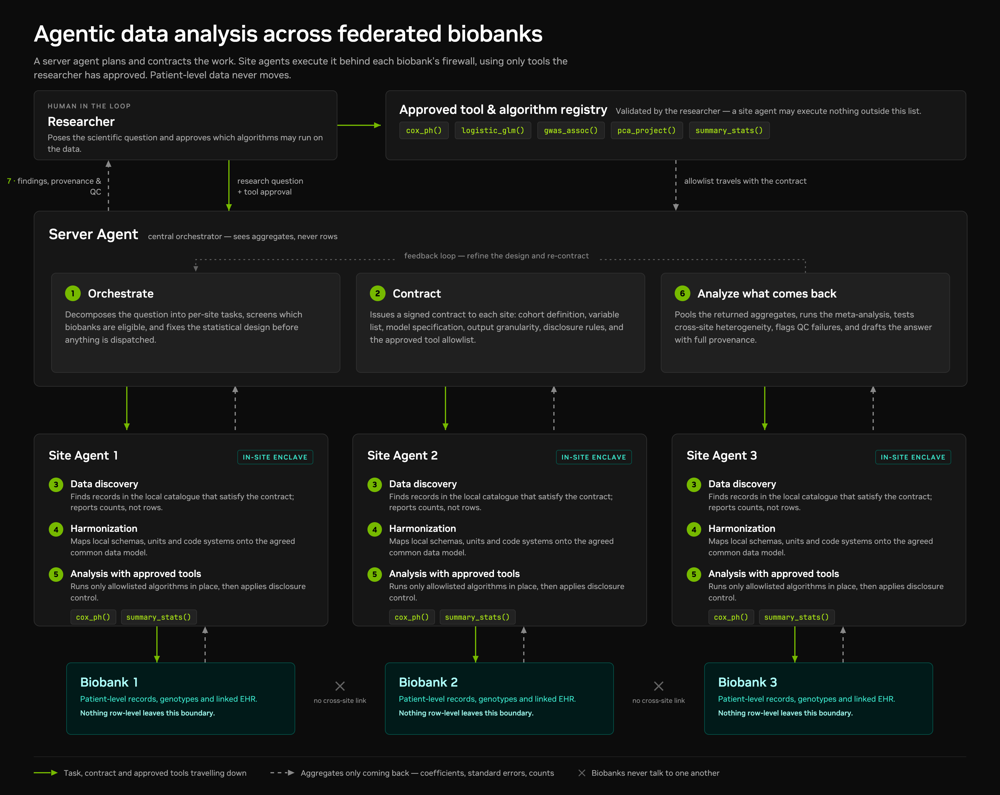
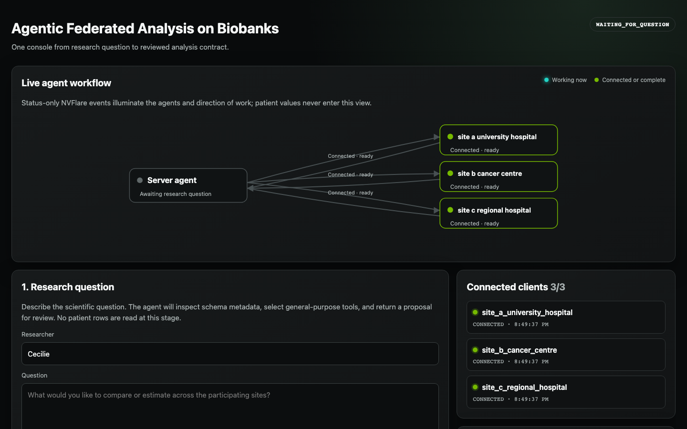

# AgentGenie

## Federated biobank workflow

This design illustrates privacy-preserving, agentic analysis across federated biobanks. It separates central coordination from local data access so that multiple institutions can contribute to a shared analysis without exchanging patient-level records.



### How the workflow operates

1. **Researcher approval:** The researcher poses a scientific question and selects the tools and algorithms that may be used. This approved registry becomes an allowlist that travels with the analysis contract.
2. **Server orchestration:** The server agent identifies eligible biobanks, decomposes the question into site-level tasks, and fixes the statistical design before execution begins.
3. **Analysis contract:** Each site receives a signed specification covering the cohort definition, variables, model, output granularity, disclosure rules, and approved tools.
4. **Local data preparation:** Behind each biobank's firewall, a site agent discovers eligible records and harmonizes local schemas, units, and coding systems to the agreed data model.
5. **Local analysis:** The site agent runs only allowlisted tools and applies disclosure controls before releasing any output.
6. **Aggregate analysis:** The server agent pools the returned coefficients, standard errors, counts, and other permitted aggregates; performs meta-analysis and cross-site quality checks; and drafts findings with provenance.
7. **Human review and refinement:** Results return to the researcher for review. Quality issues or heterogeneous results can trigger a feedback loop in which the server agent refines the design and issues a new contract.

### Trust and data boundaries

Solid green arrows represent tasks, contracts, and approved tools travelling from the coordinator to each site. Dashed arrows represent aggregate-only results returning to the server. Patient-level records remain inside their source biobank, and biobanks never communicate directly with one another.

## Analysis-only prototype

This repository includes a runnable adaptation of the medical-imaging FedReady
pattern for tabular clinical and gene data. Codex is the only generative-agent
backend. It proposes a typed analysis contract from the research question and
server-visible catalogs; deterministic, allowlisted statistical tools execute
the approved contract. There is no model training.

The workflow deliberately stops before touching patient data. The researcher
first sees which concepts the site catalogs support, the cohort definition and
fields, proposed statistical tools, disclosure rules, and unsupported requests.
Only a separate `approve` command creates an executable contract. The `run`
command rejects a proposed contract.

### General-purpose server tool registry

The statistical runtime contains no breast-cancer, TNBC, receptor, treatment,
or fixed-column logic. The server publishes a versioned registry of statistical
primitives to Codex:

- `federated_histogram`: fixed-bin numeric distributions and binned median intervals;
- `categorical_contingency`: pooled category-by-cohort tables and chi-square tests;
- `federated_kaplan_meier`: pooled event/censor histograms and product-limit curves;
- `numeric_sufficient_statistics`: pooled count, sum, sum-of-squares, mean, and SD; and
- `missingness_summary`: pooled observed and missing counts.

The Kaplan–Meier primitive generalizes the time-binned design in NVFlare's
Kaplan–Meier example. It accepts contract-defined time fields, event encodings,
subsets, grouping variables, and time bins; it knows nothing about a particular
disease or endpoint.

For every new user question, Codex must create a proposed v2 contract containing:

- named cohorts expressed with the safe predicate DSL (`all`, `any`, `not`,
  equality, membership, numeric comparisons, and missingness);
- per-site canonical field mappings, categorical value maps, and unit multipliers;
- selected registry tools with all required parameters;
- disclosure controls and requested-but-unavailable concepts; and
- an unapproved status for human review.

Sites expose only catalog metadata, declared mapping metadata, and CSV column
headers during discovery. No row values are read before approval. Once approved,
the same generic local and server implementations execute the task-specific
contract. Registry definitions are in `src/biobank_agent/tools/registry.py`;
cohort evaluation, harmonization, local aggregation, and server pooling are
separate modules in the same directory.

### TNBC demonstration contract

The included proposal compares triple-negative breast cancer (TNBC) with
non-TNBC by age and menopause, then describes overall survival among TNBC
patients by surgery, chemotherapy, hormone therapy, and radiotherapy. It also
pools sufficient statistics for a small gene panel. TNBC is explicitly defined
as ER-negative, PR-negative, and HER2-negative.

The current data do **not** contain weight, ethnicity/race, or a
progression/recurrence endpoint. The workflow reports those requests as
unsupported. It does not infer ethnicity and does not relabel overall survival
as progression-free survival. Site B's survival years are converted to months,
and Site C's binary ER coding is mapped to the common receptor representation.
Site C has clinical metadata but no gene-expression panel, so it participates
in clinical analyses only.

The TNBC JSON is a task-specific example produced on top of the general
registry. It supplies receptor-based cohort predicates, site-specific coding
and survival-unit mappings, selected fields, and analysis parameters. None of
those choices are embedded in the tools. Survival comparisons are observational
and unadjusted; they cannot establish which treatment causes longer survival.

### Run the approval workflow

From the `AgentGenie` directory, install the Python 3.9+ package. An authenticated Codex CLI is needed when
planning a new free-form question.

```bash
python3 -m pip install -e .
```

#### Recommended: one study console for question and approval

The local web console is the primary human interface. Start an NVFlare run with
`question=None`; the Controller enters `WAITING_FOR_QUESTION` instead of reading
a prompt file or command-line string:

```python
from biobank_agent.flare.job import run_biobank_simulation

run_biobank_simulation(
    workspace_root="workspace",
    sites_root="/path/to/sites",
    question=None,
    output_dir="runs",
    session_id="study-001",
)
```

In another terminal, point the study console at that same run directory. Supplying
the site and workspace locations enables the completed screen's **Start New** button:

```bash
biobank-agent serve-ui runs/study-001 \
  --sites-root /path/to/sites \
  --workspace workspace \
  --output-root runs
```

Open `http://127.0.0.1:8765`. The console provides the complete human flow:

1. enter the initial scientific question and researcher identity;
2. follow schema discovery and Codex planning status;
3. review readable cohort predicates, harmonization-dependent feasibility,
   selected general-purpose tools and parameters, privacy rules, and unsupported
   requests; and
4. type `APPROVE` or `REJECT` and submit the decision.

The browser never changes Controller state directly. It writes typed user-input
and decision artifacts; the Controller validates their schema, workflow state,
and proposal digest before proceeding. The server binds only to loopback,
requires a per-process request token, applies a restrictive content security
policy, and exposes no patient data. JSON remains the durable audit format but
is no longer the researcher-facing interface.

The commands below remain useful as headless/automation alternatives.

Ask Codex to draft a proposal from catalogs only (no patient rows are opened):

```bash
biobank-agent plan \
  --question "Compare TNBC with non-TNBC and describe TNBC survival by treatment" \
  --sites-root /path/to/sites \
  --output runs/tnbc.proposed.json
```

Or inspect the supplied reproducible proposal:

```bash
biobank-agent review examples/tnbc_contract.proposed.json \
  --sites-root /path/to/sites
```

After the researcher agrees to the displayed tools and feasibility report,
record approval and run that contract:

```bash
biobank-agent approve examples/tnbc_contract.proposed.json \
  --by researcher \
  --output runs/tnbc.approved.json

biobank-agent run \
  --contract runs/tnbc.approved.json \
  --sites-root /path/to/sites \
  --output runs/tnbc
```

Output contains one aggregate-only JSON payload per site, a pooled server
payload, a Markdown report, and SVG figures. Raw rows and patient identifiers
are never written to the run directory.

### NVFlare Controller workflow

The production-shaped path lives under `biobank_agent.flare`. Its
`BiobankAnalysisController` owns the state transition rather than relying on a
wrapper script:

```text
DISCOVERING -> PLANNING -> WAITING_FOR_APPROVAL
             -> APPROVED -> DISPATCHING_ANALYSIS -> COMPLETED
             -> REJECTED / EXPIRED / ABORTED
```

During discovery the Controller broadcasts `biobank_catalog_discovery`; its
Executors read only each site's redacted `catalog.json`. The Controller then
asks Codex for a contract (or loads a reproducible unapproved proposal), writes
the proposal and feasibility report under the server run directory, and enters
`WAITING_FOR_APPROVAL`. No task capable of opening `data.csv` has been sent at
that point.

While the NVFlare run waits, the researcher reviews those artifacts in another
terminal and records a decision:

```bash
biobank-agent approve-run runs/<session-id> \
  --decision approve \
  --by researcher
```

The command displays the cohort, proposed tools, site support, and unavailable
requests, then requires the researcher to type `APPROVE`. `--yes` is available
for an explicitly authorized non-interactive workflow. Rejection uses
`--decision reject --reason "..."`.

The approval contains the published proposal digest. The Controller validates
that digest, creates the immutable approved contract, and only then broadcasts
`biobank_approved_analysis`. Any proposal edit, stale decision, timeout,
rejection, or abort prevents analysis dispatch. Site Executors also validate
the approval and contract digest before opening their CSV and return only
aggregate payloads.

Build a job in Python using the current NVFlare `FedJob`/`Recipe` pattern:

```python
from biobank_agent.flare.job import build_biobank_recipe

recipe, clients = build_biobank_recipe(
    sites_root="/path/to/sites",
    question="Compare TNBC with non-TNBC and describe TNBC survival by treatment",
    output_dir="runs",
    session_id="tnbc-study-001",
    proposal_path="examples/tnbc_contract.proposed.json",  # omit to use Codex
)
```

Install against an NVFlare 2.9 environment with `pip install -e '.[nvflare]'`.
The Controller, client Executor, approval state machine, and job builder are in
`src/biobank_agent/flare/`.

### Timing-compressed workflow demo

[](demo-video/agentgenie-workflow-demo-clean-final.webm)

Click the preview to watch the AgentGenie workflow video. It replays a real
analysis contract and aggregate result with compressed agent wait times and is
visibly labelled as a recorded replay. The demonstration includes the initial
question, client feasibility review, researcher-supplied revision guidance, a
supported second pass, human approval, disclosure-controlled feasible-case
reporting, and the final Kaplan–Meier curve.

To reproduce the recording while the local study UI is running:

```bash
python scripts/record_demo.py \
  --sites-root /path/to/sites \
  --output-dir demo-video
```

The replay serves result artifacts from its pinned source run, so the final
curve does not depend on whichever live study session is active. It displays
`Minimal` for site-level exclusions whose exact counts would violate the
approved minimum-cell privacy rule, while retaining the exact pooled feasible
count.
