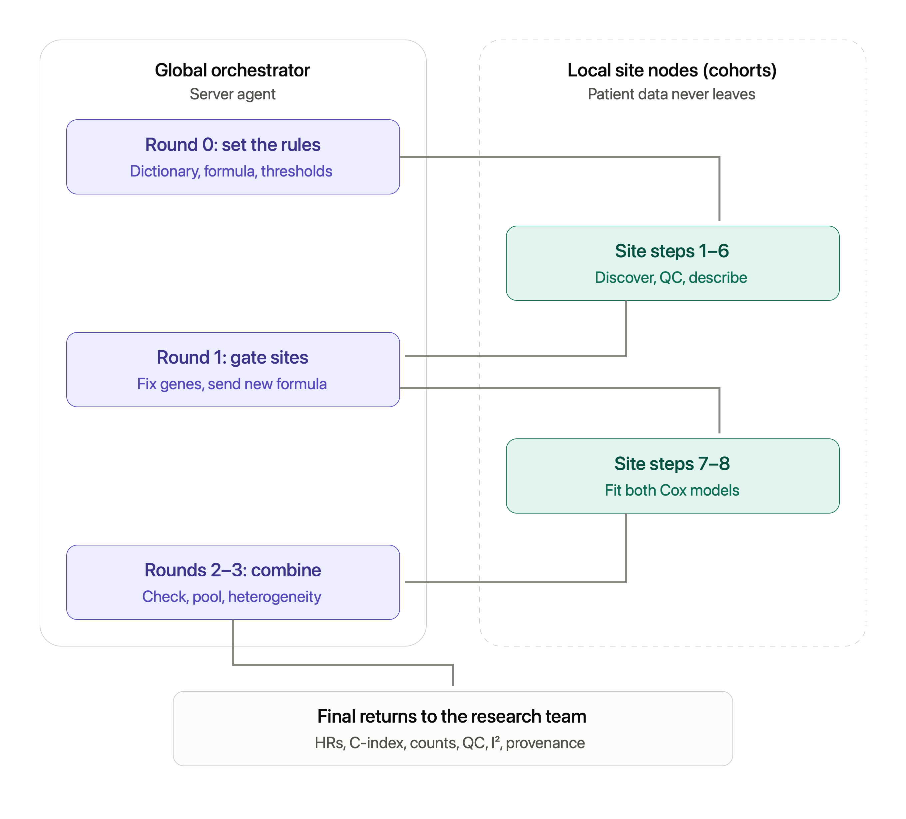

# Agent Orchestration

## Federated biobank workflow

This design illustrates privacy-preserving, agentic analysis across federated biobanks. It separates central coordination from local data access so that multiple institutions can contribute to a shared analysis without exchanging patient-level records.

### How the workflow operates

1. **Researcher approval:** The researcher poses a scientific question and selects the tools and algorithms that may be used. This approved registry becomes an allowlist that travels with the analysis contract.
2. **Server orchestration:** The server agent identifies eligible biobanks, decomposes the question into site-level tasks, and fixes the statistical design before execution begins.
3. **Analysis contract:** Each site receives a signed specification covering the cohort definition, variables, model, output granularity, disclosure rules, and approved tools.
4. **Local data preparation:** Behind each biobank's firewall, a site agent discovers eligible records and harmonizes local schemas, units, and coding systems to the agreed data model.
5. **Local analysis:** The site agent runs only allowlisted tools and applies disclosure controls before releasing any output.
6. **Aggregate analysis:** The server agent pools the returned coefficients, standard errors, counts, and other permitted aggregates; performs meta-analysis and cross-site quality checks; and drafts findings with provenance.
7. **Human review and refinement:** Results return to the researcher for review. Quality issues or heterogeneous results can trigger a feedback loop in which the server agent refines the design and issues a new contract.

### Trust and data boundaries

Solid green arrows represent tasks, contracts, and approved tools travelling from the coordinator to each site. Dashed arrows represent aggregate-only results returning to the server. Patient-level records remain inside their source biobank, and biobanks never communicate directly with one another.

Each local server node performs quality control and model fitting while the global server agent collects site results so the summary statistics 

## Team
- Cecile
- Ziyue
- Maya
- Harris
- Aryaman
- Rajarshi
- Rabindra
