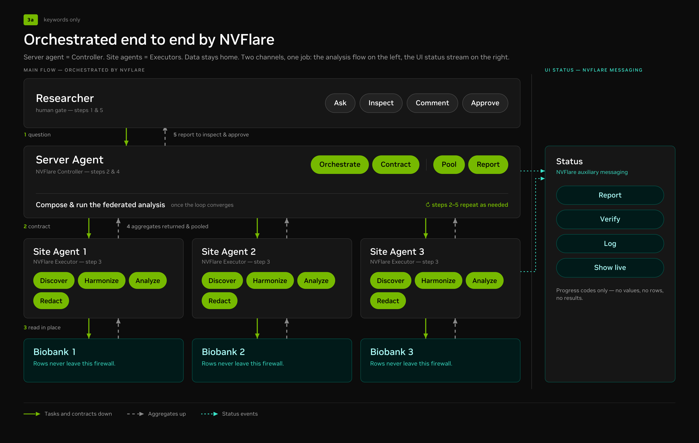

# Agent Genie 

## How to Use

Agent is a web user that gives the researcher simultaneous access to multiple biobank sites for scientific analysis without required expertise in federated computing. Biobank connection must be authorised to the local server or institution before initial use. A session begins when the user is prompted to select the preferred biobanks for analysis and enter a scientific question in natural language (Figure 1). The description including statistical methods and data stratification is entered to guide the desired output results, plots, and tables. Throughout the session the user can follow a live workflow of the NVIDIA FLARE events between the global server and local sites without viewing access to patient data. The interface displays a review analysis with the scientific question with the cohorts available within privacy limits and feasibility status of each biobank site for data harmonisation. The user is prompted to revise the scientific question with the provided server-agent recommendation. The approved plan is dispatched to the local sites. The session concludes with a study summary including final results and a Report summarizing the federated analysis concluding the search. The user can save the analysis results and prompt the interface with a new study question while maintaining the biobank client connections.

Figure 1. Agent web user interface at the start of a session with the live agent workflow.

## How to Build
Agent Genie is a federated AI system that uses a controller-executor pattern orchestrated by NVIDIA FLARE (Federated Learning Application Runtime Environment) [NVIDIA Corporation] (Figure 2). The global server agent acted as the research controller while each local site server acted as an executor within the biobank environment. A shared schema enables communication between all of the system components so that a response has the same structure. The global agent workflow consists of two phases: the discovery phase and the analysis phase. In the discovery phase, NVIDIA FLARE sends a task to each local site.The return information is collected into a catalogue service for the creation of a federated catalogue that holds shared variables across each biobank site and privacy-protected metadata. A harmoniser maps canonical variable names to the local variables reported from each biobank by the corresponding local site. In the analysis phase, the natural language user prompt is structured into an analytical plan by the global agent. The plan is checked against governance regulations by the policy layer to determine biobank eligibility in the federated search. Each site agent executes the analytical plan received from NVIDIA FLARE in the local environment. The contract contains structured specification parameters including tool, cohort, event, grouping, and time metrics that each site can map to local data columns. After local analysis, aggregated results are returned to the global agent via NVIDIA FLARE to ensure patient-level data stays within its respective biobank.

Fig 2. End-to-end orchestration of Agent by NVIDIA FLARE. The 1) research question is translated by the server agent (NVIDIA FLARE controller) into an 2) analysis contract to be 3) executed by local site agent (NVIDIA FLARE executor) at each biobank. Next 4) aggregated results are returned and pooled for researcher feedback 5) the controller- executor-controller loop is repeated until the plan is approved by the user. 

## Federated biobank workflow

This design illustrates privacy-preserving, agentic analysis across federated biobanks. It separates central coordination from local data access so that multiple institutions can contribute to a shared analysis without exchanging patient-level records.

### How the workflow operates

1. **Researcher approval:** The researcher poses a scientific question and selects the tools and algorithms that may be used. This approved registry becomes an allowlist that travels with the analysis contract.
2. **Server orchestration:** The server agent identifies eligible biobanks, decomposes the question into site-level tasks, and fixes the statistical design before execution begins.
3. **Analysis contract:** Each site receives a signed specification covering the cohort definition, variables, model, output granularity, disclosure rules, and approved tools.
4. **Local data preparation:** Behind each biobank's firewall, a site agent discovers eligible records and harmonizes local schemas, units, and coding systems to the agreed data model.
5. **Local analysis:** The site agent runs only allowlisted tools and applies disclosure controls before releasing any output.
6. **Aggregate analysis:** The server agent pools the returned coefficients, standard errors, counts, and other permitted aggregates; performs meta-analysis and cross-site quality checks; and drafts findings with provenance.
7. **Human review and refinement:** Results return to the researcher for review. Quality issues or heterogeneous results can trigger a feedback loop in which the server agent refines the design and issues a new contract.

### Trust and data boundaries

Solid green arrows represent tasks, contracts, and approved tools travelling from the coordinator to each site. Dashed arrows represent aggregate-only results returning to the server. Patient-level records remain inside their source biobank, and biobanks never communicate directly with one another.

Each local server node performs quality control and model fitting while the global server agent collects site results. Summary statistics are displayed on the UI and patient data is never revealed.

The runnable federated-analysis implementation developed here is packaged in [`AgentGenie/`](AgentGenie/README.md).

## Team
- Cecilie
- Ziyue
- Maya
- Harris
- Aryaman
- Rajarshi
- Rabindra
